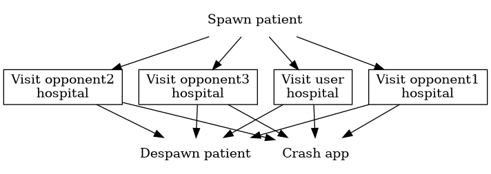
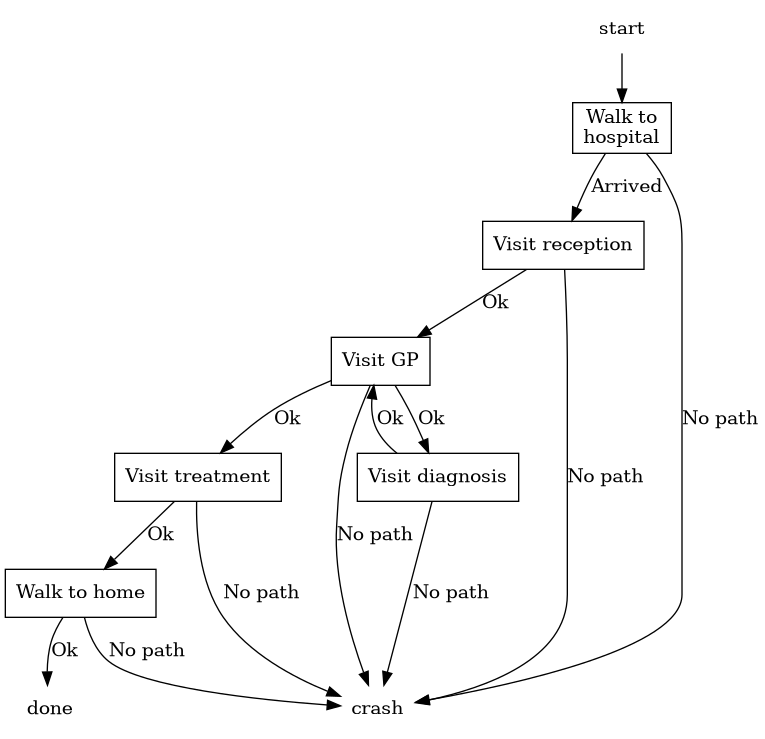
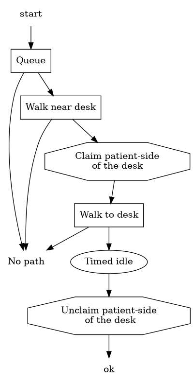
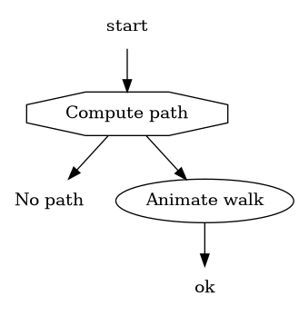

== Humanoid behaviour

All humanoid behaviour must be expressed as animations. Currently the action
queue of individual humanoids shows animations, but that is found to be fragile.
A second reason is that many different new programmers have been working in
the code, and many of them added new code and new variables without
considering completely how they related to other variables, and without
documenting them.

The overall result is a piece of software that is so complicated that nobody
knows exactly what it does.

In an attempt to improve the situation, this document is describing all the
behaviour that needs to be implemented. It uses state diagrams.
Several kinds of states exist, shown by different shapes:

* The starting and finishing points in a diagram are shown as plain text.
* A state that is unfolded in more detail elsewhere has a rectangular box.
* A state that computes something has an octagon box.
* Passing of time by showing an animation has an ellipsoid box.

Arrows from one state to another state indicate possible successor states. An
arrow may have text to clarify its purposes, but usually the context is
sufficient to understand it. Traversing an arrow is instantly.

Each class of humanoids has its own set of state diagrams.
Below, a few of the patient diagrams are shown.

=== Global flow of a patient

The global flow of a patient is as follows:

First a patient is spawned, then it visits one of the four hospitals, and
either the patient despawns, or the game crashes:

* Obviously, it is not a goal to crash the application. The reason that it is
listed here, is to make clear that not all details have been worked out.
States should be added to handle the cases that currently lead to the crash
finishing point.

* While the game has four hospitals, it is not clear whether they all need
to be shown here. They were added, because in multi-player mode inter-action
between hospitals may exist, and these should be included.

The hospital visit state has a rectangular box. That means there is another
state diagram that described the visit in more detail:

[[hospital-process]]
=== Hospital process

Visiting a hospital is done as follows:

The initial and finishing states here are part of the previous diagram. They
are shown here to express how the states outside the diagram connect to the
states in the diagram.
The patient starts with walking to the hospital. Once it arrives there, it
visits the reception.
Next, the diagram shows the general diagnosis and treatment process of a patient.

What is currently missing here at least is to have multiple treatment rooms.
Other parts may also be incomplete.

=== Visiting the reception

The process of visiting a reception is:

Visiting the reception is different with visits to other rooms as there is no
door. For thsi reason it currently has a diagram of its own, but maybe it is
possible to unify the diagram with visit diagrams of other rooms.

The visit starts with queueing, followed by walking to near the desk, claiming
the desk as visitor, walk properly to the desk, wait a while (simulating
talking with the receptionist), and then release the reception desk to make it
available for the next patient.

The diagram assumes there is no need to first walk away from the desk. Likely
that is correct in the sense that the next activity of the patient is to walk
to a different location.

Several 'no path' exists exist here that should be handled differently.

=== Walking

Walking is a common activity of a humanoid. It has a diagram of its own, like
the 'Walk to hospital' state in <<hospital-process>> above.

It works by first computing a path. If that fails, it exits with 'No path'
that needs to be dealt with in a higher diagram.
If a path can be found, it runs the walk animations of the path and then it is
finished.

Currently missing here is the case that a computed path is found to be blocked
while walking.
